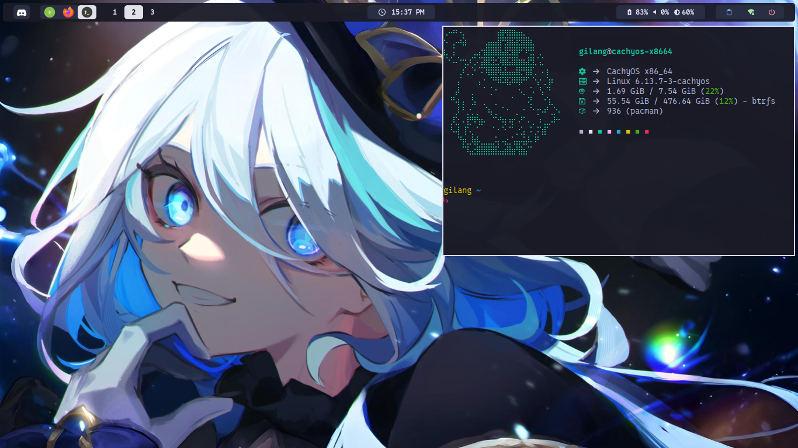

# 🪟 Sway Configuration

This directory contains my minimalist configuration for **[Sway](https://swaywm.org/)**, a tiling Wayland compositor compatible with i3. Managed using [GNU Stow](https://www.gnu.org/software/stow/) as part of my dotfiles setup.

## 📸 Screenshots

<table>
  <tr>
    <td align="center">
      
      <br />
      <strong>SwayWM</strong>
    </td>
  </tr>
</table>

## 🛠 Requirements

Make sure the following are installed on your system:

```bash
# Core
sudo pacman -S sway swaybg foot waybar wl-clipboard fish ttf-0xproto-nerd autotiling cliphist

# Tools
sudo pacman -S grim dunst rofi-wayland brightnessctl fastfetch micro mpv yt-dlp

# File manager
sudo pacman -S thunar gvfs thunar-archive-manager file-roller tumble

# Lock screen
yay -S swaylock-effects
```

Also recommended:

- `pipewire` or `pulseaudio` for audio support
- `xdg-desktop-portal-wlr` for screen sharing support

## 🚀 Installation

Clone the dotfiles repo:

```bash
git clone https://github.com/gilangarya01/sway.git ~/dotfiles/sway
cd ~/dotfiles
```

Use `stow` to link the Sway config:

```bash
stow sway
```

This will link your Sway config to `~/.config/sway/`.

## 💡 Tips

- Modify keybindings in the `.config/sway/config` file
- Tweak appearance in the `.theme` and `.icons` file
- Add custom scripts in `.scripts/` and call them from keybindings or startup
