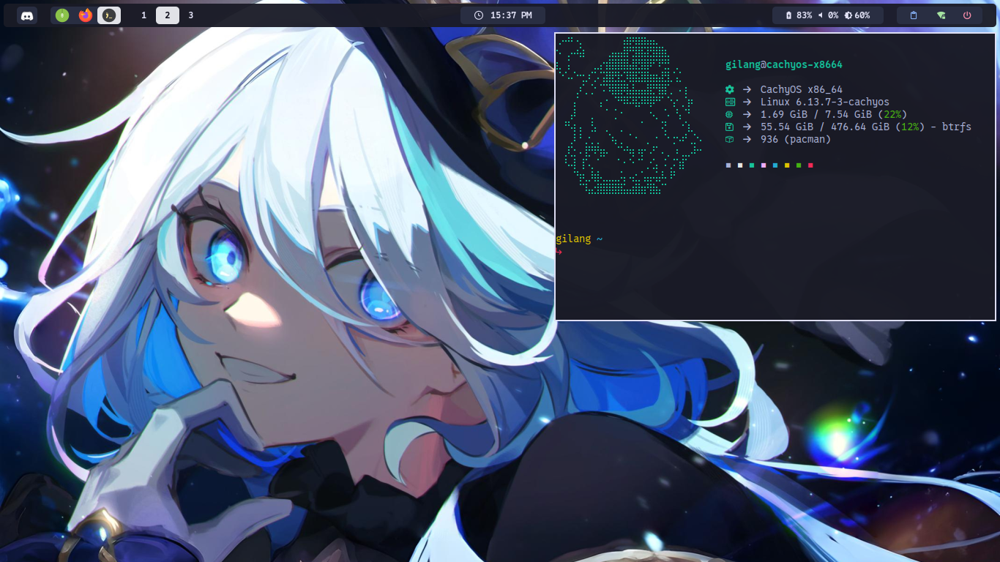

# Sway Dotfiles



This repository contains configuration files (dotfiles) to set up a streamlined, visually appealing Sway desktop environment. The goal is to provide a clean, functional, and personalized desktop experience.

## Features
- **Sway Customization**: Includes configurations for panel layout, themes, and keyboard shortcuts.
    - **Themes**: Tokyonight-Dark
    - **Icons**: Tela circle dark
    - **Cursor**: Bibata-Modern-Ice

## Installation
#### 1. Clone the Repository
Clone this repository to your home directory:
```bash
git clone https://github.com/gilangarya01/sway.git
cd ~/sway
```

#### 2. Copy or Rsync Dotfiles
```bash
cp -r ./ ~/
# or
rsync -av ./ ~/
```
Log out and log back in, or restart your system.

